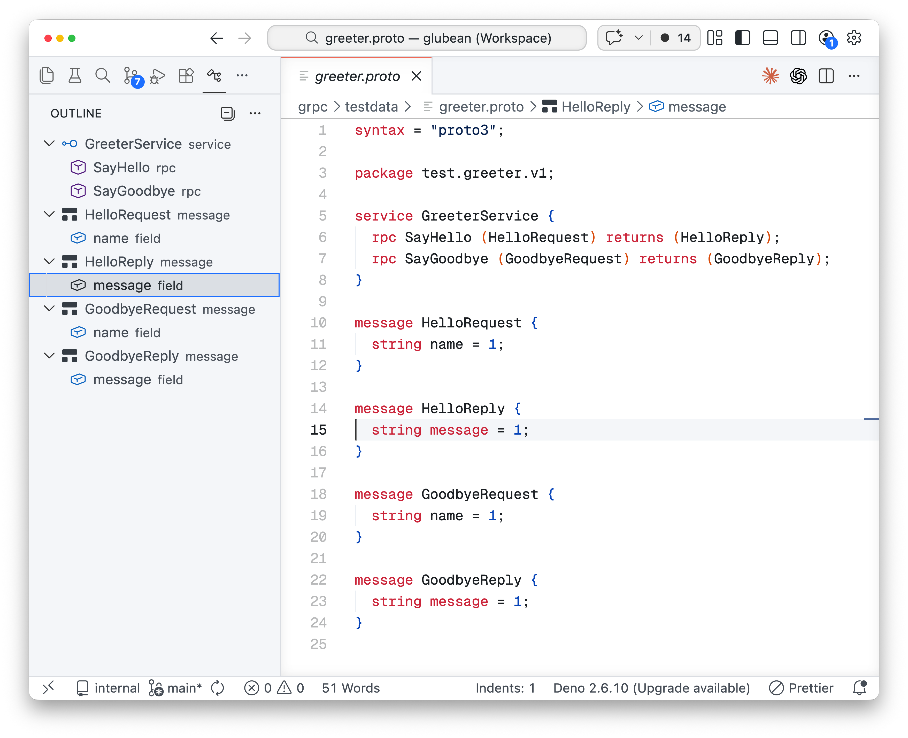
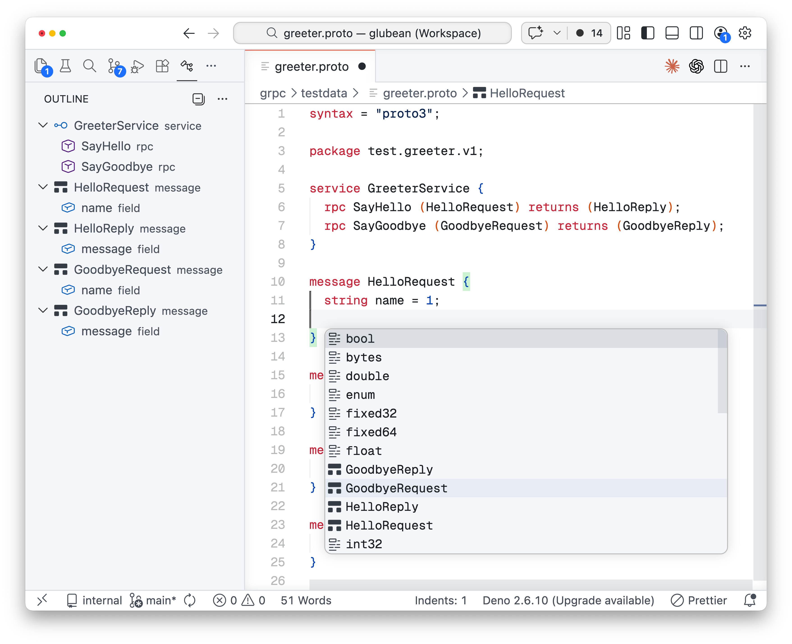

# Proto3 Tools

`Proto3 Tools` is a lightweight Visual Studio Code extension for `.proto` files — no separate language server, just the editor features you need.

Syntax highlighting and outline for gRPC-oriented `.proto` files:



Completion for scalar types, messages, enums, and service authoring:



## Features

- Syntax highlighting for `.proto`
- Snippets for file headers, messages, enums, services, RPCs, and imports
- Completion for top-level keywords, message/service bodies, scalar types, common options, and local message/enum names
- Go to Definition for imports, messages, enums, and services
- Rename across the current file plus directly related imported/importing proto files
- Document Symbols / Outline for messages, enums, enum values, services, RPCs, oneofs, and fields
- Renumber Fields/Enum Values command
- `protoc` diagnostics on save
- `proto3: Compile This Proto`
- `proto3: Compile All Protos`
- `clang-format` document formatting
- Markdown fenced-code highlighting for `proto` and `protobuf`

## Commands

| Command | Description |
| --- | --- |
| `proto3: Compile This Proto` | Compile the active `.proto` file with configured `protoc` arguments. |
| `proto3: Compile All Protos` | Compile every `.proto` file under the configured compile root. |
| `proto3: Renumber Fields/Enum Values` | Renumber message fields from `1` or enum values from `0` in the current scope. |

## Settings

The extension keeps the old `protoc.*` settings shape so migration is straightforward.

```json
{
  "protoc.path": "protoc",
  "protoc.options": [
    "--proto_path=${workspaceRoot}/proto",
    "--go_out=gen/go"
  ],
  "protoc.compile_on_save": false,
  "protoc.renumber_on_save": false,
  "protoc.compile_all_path": "",
  "protoc.use_absolute_path": false,
  "clang-format.style": "file",
  "clang-format.executable": "clang-format"
}
```

### Supported variables

- `${workspaceRoot}`
- `${env.NAME}`
- `${config.some.setting}`

## Behavior Notes

- Diagnostics come from `protoc`, not from a custom semantic engine.
- Rename is intentionally conservative in scope: current file plus directly related proto files.
- `Compile All` recursively scans the configured directory for `.proto` files.
- Formatting requires `clang-format` to be installed locally.

## Limits

This extension does not implement:

- a full language server
- semantic references / hover / code actions
- build-system-specific `buf` or Bazel integration
- gRPC request execution or schema testing

## Development

```bash
npm install
npm run build
npm test
```

Package a VSIX with:

```bash
npm run package:vsix
```

## About Glubean

`Proto3 Tools` is maintained by Glubean and stays focused on `.proto` authoring inside VS Code.

If you later need workflow-oriented API or gRPC testing, Glubean will be the broader product surface. This extension is intentionally the lightweight editor entry point.
